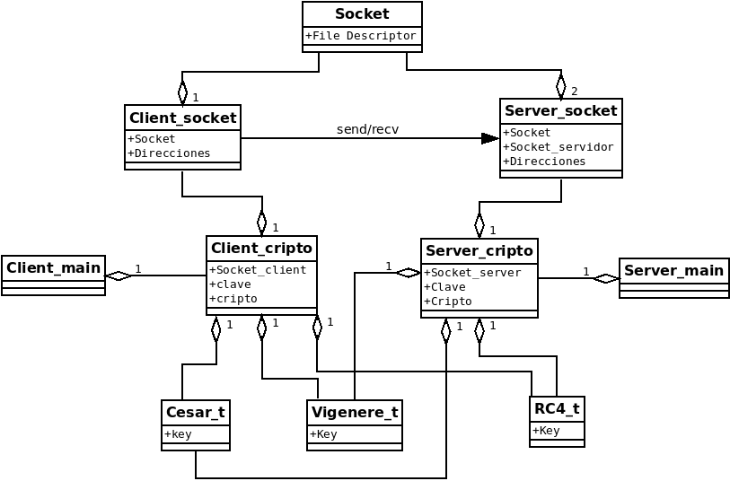
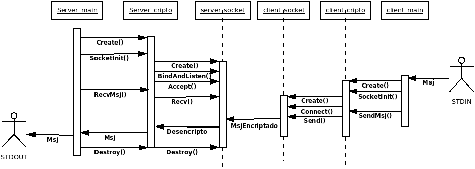

# TP1

## Nombre y Apellido: Axel Aparicio Rotermund
## Padron: 96283
## Link Github: https://github.com/axlrott/TP1-2C-2020.git

### Introduccion:

En este trabajo practico se realizaron dos programas, uno en el cual se recibe un mensaje por entrada estandar, se lo encripta y luego se lo envia por un socket cliente y otro programa en el cual se lo recibira mediante un socket servidor, se desencripta el mensaje y luego se lo muestra por pantalla.

### Encriptaciones:

Las encriptaciones utilizadas en los programas van a ser Cesar, Vigenere y RC4.
Cada una de estas encriptaciones van a ser estructuras, las cuales van a recibir sus respectivas claves y encriptaran/desencriptaran en base a eso.

#### Cesar:

La encriptacion de cesar va a recibir una clave al ser creada, la misma va a ser una cadena de caracteres pero debe representar un numero.
Al encriptar se recibira una cadena de caracteres y el largo de la misma y a cada caracter de esa cadena se le sumara el numero de la clave. En el caso de desencriptar se hara lo mismo pero en vez de sumar la clave se la restara.

#### Vigenere:

La encriptacion de Vigenere recibe una clave que va a representar una palabra y se inicializa la posicion de la clave en 0.
Al encriptar se recibe una cadena de caracteres y el largo, se encripta sumando cada caracter con el respectivo caracter de la clave, cuando la clave llega a la posicion final se vuelve al primer caracter de la clave y se continua sumando. Al desencriptar es lo mismo solo que restando caracter con caracter de la clave.

#### RC4:

La encriptacion RC4 recibe una clave que representa una palabra y al inicializarse ya crea un array haciendo KDA. Al encriptar utiliza PRGA para tomar una clave de ese array creado y hacer un XOR con cada caracter de la cadena a encriptar. El desencriptar una cadena es hacer lo mismo que encriptarla.

### Sockets

El socket va a contener todas las funciones principales de los sockets (bind, accept, listen, connect, etc) con algunas modificaciones en algunos de ellos, como por ejemplo el recv y el send que buscaran recibir todo el largo de la cadena enviada/recibida.

#### Socket Cliente:

El socket Cliente se va a crear pasandole por parametro el host y el puerto a utilizar.
Durante la creacion del socket se iran iterando todas las listas de direcciones posibles dado el host y el puerto hasta encontrar una en la que sea posible crearse el socket y a la vez conectarse.
Todas las funciones del socket cliente van a devolver 0 en caso de exito y devolveran -1 en caso de falla, tambien en caso de que haya alguna falla el socket se llamara a la funcion **Destroy** internamente y se cerrara.
La funcion **send** recibira una cadena de caracteres y un largo, y se enviara ese largo de la cadena de caracteres, en caso de que al enviarse se mandace menos del largo se volvera a mandar lo que resta de la cadena hasta cumplir con que se haya enviado el largo pasado por parametro.

#### Socket Servidor:

El socket servidor se creara pasandole el puerto a utilizar como parametro.
Durante la creacion del socket se iran iterando las distintas direcciones posibles dado el host pasado por parametro hasta encontrar una en la que el socket sea creado con exito.
Todas las funciones a excepcion del **recv** devolveran 0 en caso exitoso o -1 en caso de que haya alguna falla y al igual que en el socket cliente si se detecta una falla el socket se llamara a la funcion **Destroy** internamente y se cerrara el socket.
La funcion **recv** va a recibir de un socket cliente y guardar lo que reciba en la cadena de caracteres pasada por paramentro hasta que se alcanze el largo especificado que se pase por parametro o hasta que el socket cliente se haya cerrado.

### Client Cripto:

El clCript (Client Cripto) recibira al ser creada un metodo de encriptacion y una clave para ser utilizada con la encriptacion, esta clase servira para crear un socket del tipo cliente que se hara mediante una funcion a la cual se le pasara el host y el puerto, con este socket creado se podra luego llamar a la funcion para enviar mensaje, la cual recibira el nombre de un archivo, el cual lo ira tomando de a chunks de 64 bytes los encriptara con la encripcion y la clave pasadas al ser creadas y luego los enviara por el socket cliente ya creado anteriormente.

### Server Cripto:

El svCript (Server Cripto) recibira al ser creada un metodo de encriptacion y una clave, esta clase servira para crear un socket del tipo servidor mediante una funcion, la cual recivira el puerto y la cantidad de listen, y este socket lo utilizara para recibir un mensaje encriptado por el metodo y con la clave especificadas al crear el svCript, este mensaje se ira recibiendo de a chunks de 64 bytes y se ira desencriptando y mostrando por pantalla.

### Cliente Main:

El cliente main recibe el host, puerto, metodo de encriptacion y clave, tambien por entrada estandar recibira el mensaje a encriptar y enviar al servidor.
Se va a corroborar que la cantidad de parametros sea correcta, luego se guardara la clave pasada, y se procedera a crear la clase Client Cripto con tipo de encriptacion que usaremos y la clave, luego se le inicializara el socket pasandole el host y el port que nos llego por entrada estandar, luego le diremos que envie el mensaje y al finalizar liberaremos la memoria.

### Servidor Main:

El servidor main va a recibir el puerto, el metodo de encriptacion y la clave.
El mismo corroborara que se hayan pasado la cantidad de argumentos validos, va a guardar la clave y luego va a proceder a crear el Server Cripto, al cual le vamos a pasar el tipo de encriptacion y la clave, se inicializara el socket y luego se llamara a la funcion para recivir mensajes, luego de esto se liberara la memoria.

### Diagramas:

#### Respondiendo a lo planteado en el informe:

>¿Debería el TDA Socket saber sobre algún cifrador? ¿Debería, por el contrario, saber algún cifrador sobre TCP? ¿Y quién lee de entrada estándar?

El TDA Socket, ya sea cliente o servidor no deberia saber sobre ningun cifrador, solo deberian actuar como enlaces entre sockets, asi de la misma forma los cifradores no deberian saber sobre TCP solo deberian tener como funcion encriptar y desencriptar cadenas de caracteres que se le pasen basadas en el key o clave con el que se hayan creado. En el caso de mi TP quien lee de entrada estandar es el client_main.
